# Album Management System

## Introduction

The Album Management System is a web application that allows users to create, edit, and delete albums, as well as upload and delete photos. It also includes an admin role that can manage user authorities and view the total number of users. The application uses JWT for security and login. The backend is implemented using Java REST API with Spring Boot, and the frontend is built with React JS and Material-UI.

## Features

- **Login/Registration**

  - Secure login and registration using JWT (60 minutes timeout).

- **User Roles**
  - Admin Role
    - View total users.
    - Edit user authorities.
    - Create, edit, and delete their own albums and photos.
  - User Role
    - Create, edit, and delete albums.
    - Upload and delete photos.

## Technology Stack

- **Backend**

  - Java REST API with Spring Boot
  - JWT for security

- **Frontend**
  - React JS
  - Material-UI

## Installation

### Prerequisites

- Java 8 or higher
- Node.js
- npm (Node Package Manager)
- Maven

### Backend Setup

1. Clone the repository:

   ```bash
   git clone https://github.com/anilrasal/My-Album-full-stack-app.git

   ```

2. Navigate to the backend directory:

   ```bash
   cd My-Album-full-stack-app/Java backend
   ```

3. Install dependencies and build the project using Maven:

   ```bash
   mvn clean install
   ```

4. Run the Spring Boot application:

   ```bash
   mvn spring-boot:run
   ```

### Frontend Setup

1. Navigate to the frontend directory::
   ```bash
   cd My-Album-full-stack-app/React JS Front End
   ```
2. Install dependencies::

   ```bash
   npm install
   ```

3. Run the React application::

   ```bash
   npm start
   ```

### Usage

1. Open your browser and go to http://localhost:3000.

2. Register a new account or log in with your existing account.

3. Use the navigation menu to create, edit, and delete albums, and upload or delete photos.

4. Admin users can access the admin panel to view total users and edit user authorities.

## Screenshots

- About Page which can be viewed without login as well:

  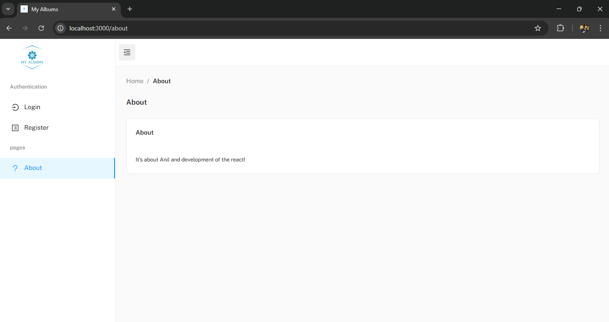

- Login Page:

  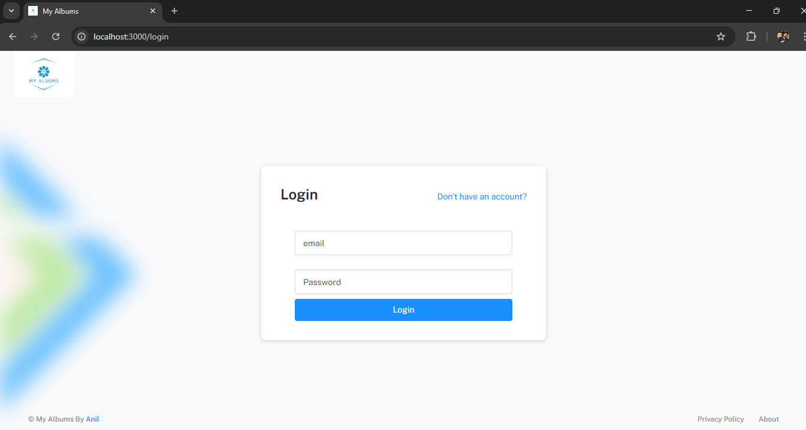

- Register Page:

  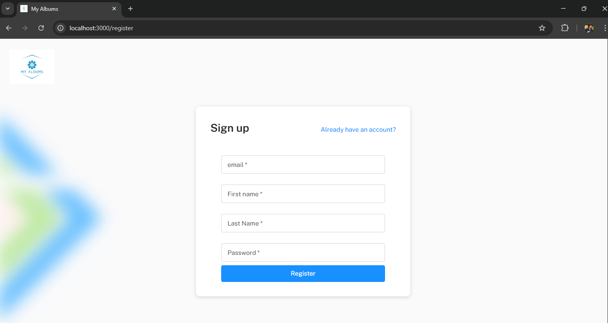

- Albums Home Page:

  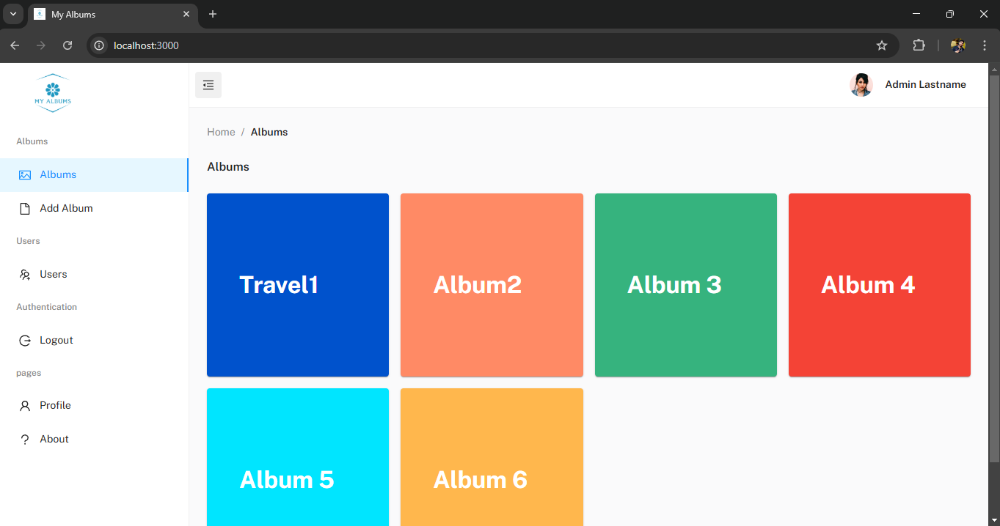

- Add Album Page:

  

- Users List Page for admin only:

  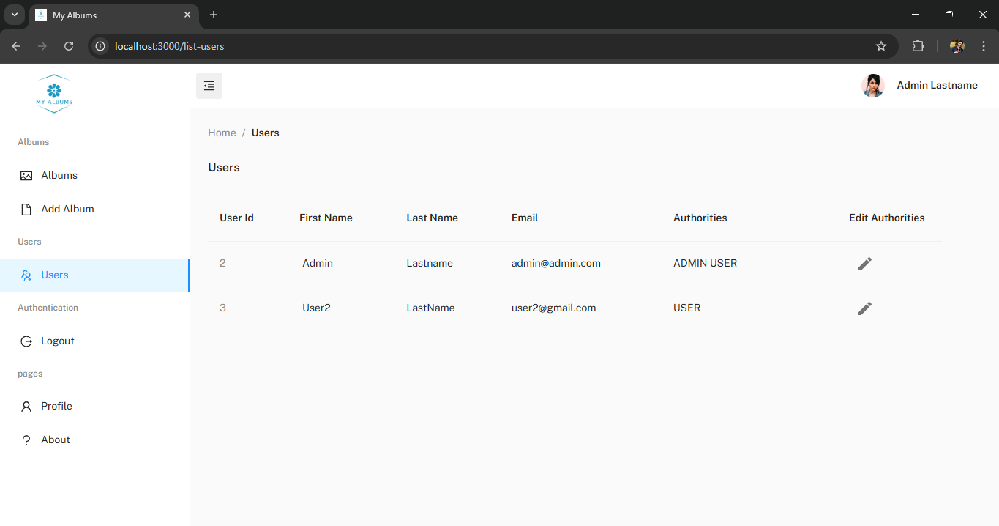

- View Photos Page:

  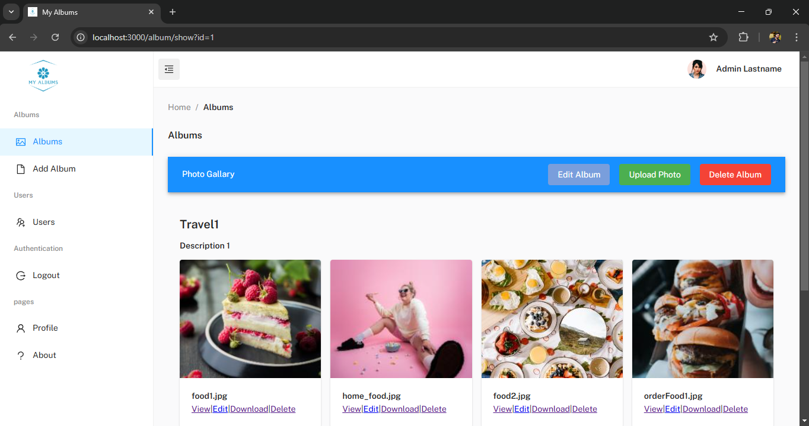

- View Or Download photo Page:

  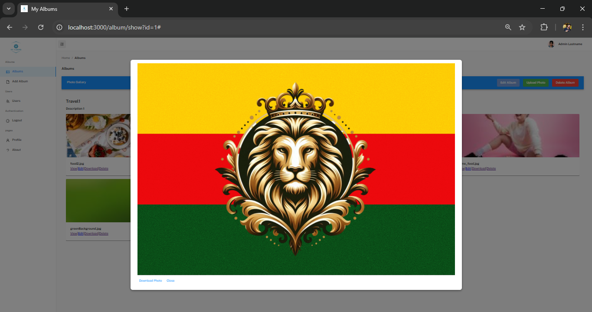

- Upload Photos Page:

  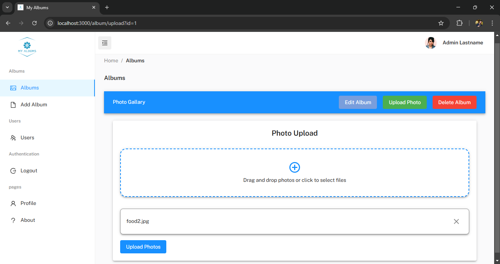

- Edit Album Page:

  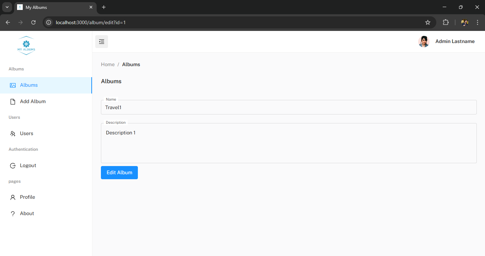

- User Profile Menu Top Right Corner For Easy Access:

  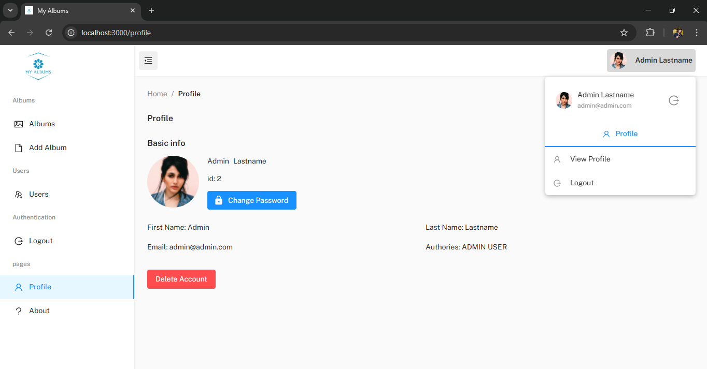

- User Profile Page:

  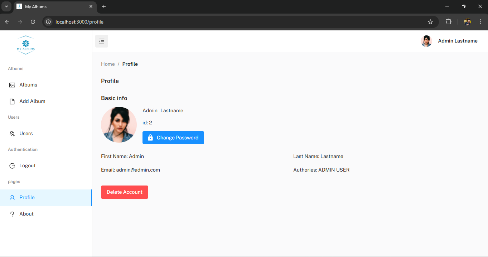

- Change Password Page:

  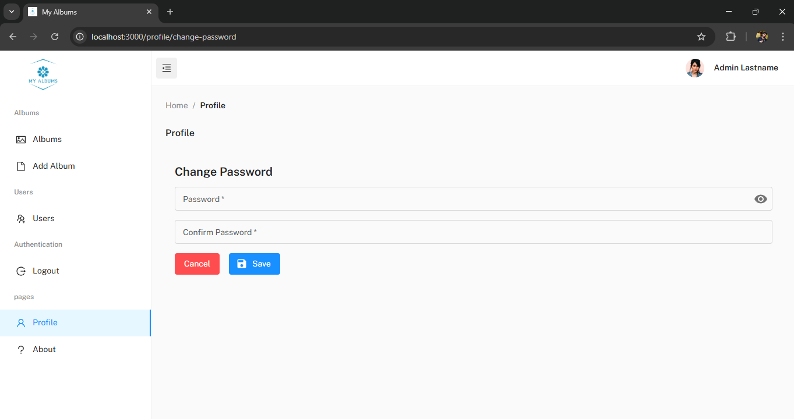

### API Endpoints

- **Auth**

  - POST /api/v1/auth/register: Register a new user.

  - POST /api/v1/auth/login: Log in with existing user credentials.

  - GET /api/v1/auth/profile: Get user profile.

  - PUT /api/v1/auth/profile/update-password: Update user password.

  - DELETE /api/v1/auth/profile/delete: Delete user profile.

  - POST /api/v1/auth/token: Obtain a new token.

  - GET /api/v1/auth/users: Get total users.

  - PUT /api/v1/auth/users/{id}/update-authorities: Edit user authority.

- **Albums**

  - PUT /api/v1/albums/{album_id}/photos/{photo_id}/update: Edit a photo in an album.

  - POST /api/v1/albums/{album_id}/upload_photos: Upload photos to an album.

  - POST /api/v1/albums/add: Create a new album.

  - GET /api/v1/albums: Get all albums.

  - GET /api/v1/albums/{album_id}: Get a specific album.

  - GET /api/v1/albums/{album_id}/photos/{photo_id}/download-thumbnail: Download a photo's thumbnail.

  - GET /api/v1/albums/{album_id}/photos/{photo_id}/download-photo: Download a photo.

  - DELETE /api/v1/albums/{album_id}/delete: Delete an album.

  - DELETE /api/v1/albums/{album_id}/photos/{photo_id}/delete: Delete a photo from an album.

## License

This project is licensed under the MIT License.
